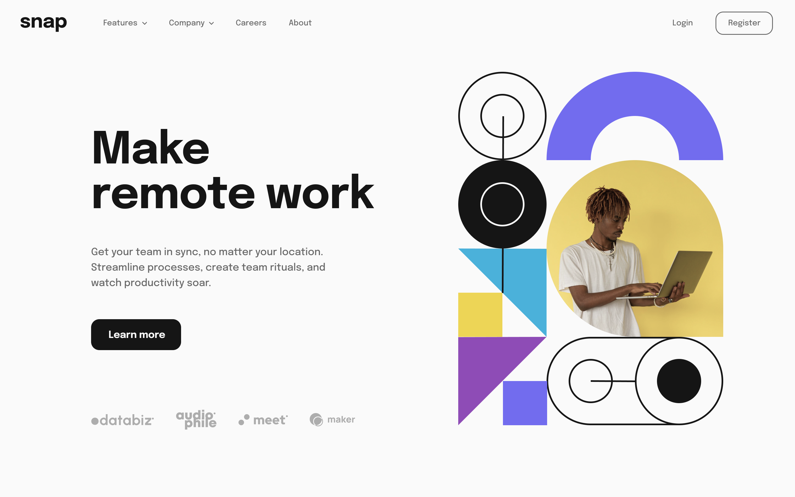

# Intro section with dropdown navigation solution

## Table of contents

- [Overview](#overview)
  - [The challenge](#the-challenge)
  - [Screenshot](#screenshot)
  - [Links](#links)
- [My process](#my-process)
  - [Built with](#built-with)
  - [Useful resources](#useful-resources)
- [Author](#author)

## Overview

### The challenge

Users should be able to:

- View the relevant dropdown menus on desktop and mobile when interacting with the navigation links
- View the optimal layout for the content depending on their device's screen size
- See hover states for all interactive elements on the page

### Screenshot

### Links

- Live Site URL: [Netlify](http://remote-work-tyrell.netlify.app)

## My process

### Built with

- Semantic HTML5 markup
- CSS variables
- Flexbox
- CSS Grid
- Bootstrap
- Mobile-first workflow

### Useful resources

- [Boostrap Docs](https://getbootstrap.com/docs/5.2/getting-started/introduction/) - This doc helped me sharpen up my bootstrap skills.

## Author

- Website - [Tyrell Curry](https://www.tyrellcurry.io)
